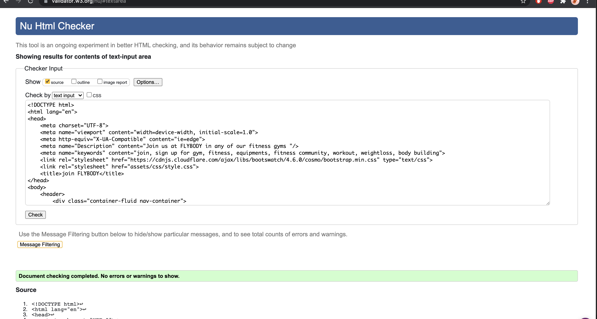

# FLYBODY  

[View the main README file here](README.md)

[View the delopyed site](https://didisimmons.github.io/Flybody-gym/)

## TESTING 

### Validator Testing 
* [W3C CSS validation](https://jigsaw.w3.org/css-validator/): This is used to validate the CSS code used on all six webpages created. Our code is found to be error-free by the validator. Please see the screenshot below. 

* [W3C Markup Validation](https://validator.w3.org/): This is also used to check the validity of the html code for all the  six webpages created. Our code was found to be error-free by the validator. See screenshot below for all pages. 

### User stories Testing 

The most common path for our user through the website: 

* Rates > Timetable > Instructors > Login > Join Us 
 
An alert message appears at the top of the navigation bar and can be dismissed. We can test this by changing the screen width in Chrome Dev Tools, the alert message shrinks. Starting with the desktop view, it can be observed to be responsive when the screen width is reduced. The alert message is included on all five pages so that the user is aware of the new Covid guidelines before attending an in-class session.

The user can easily navigate to the next page from any of the sites by lingering over any of the required five webpages. The home page is represented by the FLYBODY logo. If the user clicked, they would be taken to the main page of the website.

The user may quickly sign up to FLYBODY gym using the call to action button on the hero image on the main page, which is the home page. They can quickly examine the amenities, benefits, team members, customer reviews, and a newsletter subscription button. If the user does not interact with the other pages, this is all on one page.

When the screen width is set to a desktop view, the FLYBODY logo on all devices takes the user to the homepage, and when the user hovers over any of the webpage links, it is highlighted with a light grey backdrop. The navigation bar on a tablet or mobile device is a hamburger icon that, when clicked, allows the user to hover over the five  webpages and see the grey highlight backdrop. 

- As a customer I want to : 

1. Easily navigate the site and get the information I need to take the necessary action

    1. All of the webpages contain a navigation bar with five clearly labelled weblinks that, when clicked, take the user to different activities and examine different information about FLYBODY.

    2. When the FLYBODY logo is clicked, it takes the user to the home page.

    3. The user can navigate down the webpage to see the perks, deals, and take various tasks, as well as learn more about the gym.

    4. All of the call to action buttons on the webpages either redirect the user to another page or open a form to be filled out, which notifies the user of the next action once completed.

    5. When any of the buttons on the website is clicked, it opens on a new window to avoid bad user experience .

2. Be able to readily discover FLYBODY online on their social networks to ensure that the information and locations supplied are legitimate and trustworthy.

    1. FLYBODY has published their social media handles at the bottom of all webpages, which the user can easily click on and be sent to their social media accounts to validate legitimacy.

    2. In the about us part on the home page, a brief history of FLYBODY is offered, as well as the names and levels of competence of its team members. The user can simply check their legitimacy by researching their names/credentials online.

    3. The instructors website also includes information on all of the trainers, including their areas of specialization and years of experience. The user can readily authenticate the expertise of these teachers by researching them on their social media sites.

    4. To build trust with users, a reviews area has been included to display users feedback from real users from various industries to hear their thoughts on FLYBODY. This can have an impact on the users' trust in the brand.

    5. The footer of every pages includes a phone number and the location of the company's headquarters, which can be confirmed using Google Maps. To ensure validity, the phone number can also be contacted.

3. Easily examine the gym's fees as well as their locations so that I can quickly determine if it fits my budget and is close by.

    1. On all webpages, the customer will see the rates pricing page, which displays all of the memberships offered by FLYBODY and allows them to choose one that meets their budget.

    2. The user can see other FLYBODY locations in the footer section and see if it is close to them. To confirm the address and costs, users can call the phone number. 

4. View the class schedules and conveniently book/join classes online.

    1. There is a clearly labelled timetable page on the navigation bar on all webpages that provides the days and times for the classes offered at FLYBODY. The user may quickly hover over the classes to see the dates and timings.

    2. Instructions on how to book a class online and in person can also be found on the timetable page under the timetable. 
        
5. Be able to easily locate a personal trainer online and learn more about them so I know what to expect.

    1.	On the navigation bar, which is accessible on all pages, there is a clearly visible instructor page that displays all of the trainers at FLYBODY.

    2.	The instructor page displays thumbnail photographs of the trainers along with their names, areas of specialization, and years of experience. This can affect the user's selection on which trainer they want to work with and, if necessary, research more about them or call in to arrange a session.
     
6. The site should be visually appealing in order to keep me interested and present appealing offers on the site.

    1. Images have been used on all of the webpages to enhance the site and appeal to the experience that can be expected at FLYBODY. To make the site more visually appealing, icons have been utilized to convey certain information.

    2. When a user clicks on the FLYBODY logo and is redirected to the homepage, the user can view all of the services and perks provided by FLYBODY.

    3. When a user arrives at the home page, there is a call to action button tempting the visitor to sign up for a low cost with no deposit required. When the user clicks, a form appears for the user to fill out, which takes less than a minute and, when done, brings the user to FLYBODY's thank you page.

    4. The prices page on the navigation bar also offers inexpensive membership costs with packages that suit different people's budgets if they join FLYBODY.

 7.	Log in to my account quickly and easily to track my fitness goals, book classes, and engage with the rest of the fitness community.

    1. The navigation bar, which is visible on all pages, contains a clearly labelled login page that, when clicked, displays one column requesting the user for their login credentials to enter their portal.

    2.	In the future, after users log in to their portal, they will be able to track their fitness goals, book classes, and interact with other users via the fitness community.

8. 	Find low-cost memberships that can be tailored to my needs without breaking the budget.  

    1. The user can view the many membership plans offered by FLYBODY and choose one that fits their budget on the pricing page (rates) , which is accessible via the navigation bar on all pages.

### Testing All Features And Elements On The Page 

To test the responsiveness of each of the webpages the Chrome dev tools were employed to test the pages by changing the screen sizes of the device.

#### Homepage

 1. Navigation bar 

     1. Go to the Index page(Home)  on a desktop . 

     2. Change the desktop's screen size to that of a tablet device to ensure that the navigation bar is responsive and changes to a hamburger dropdown symbol when the medium break point is reached. The navigation bar should be positioned correctly, with the menu items in place.

         There was no overflow of the navbar or undesirable modifications to the menu items when testing the responsiveness of the navbar. The navigation bar changed to a hamburger dropdown symbol with the dropdown menu items in situ, as intended.

    3. Hover over the alert dismissive message button and make sure it does not create any undesirable changes to the navigation bar when exited.

          When tested on all devices, the alert dismissive button shuts without impeding the navigation bar. The navigation bar is still present, as expected.

    4. Hover your mouse over the navbar menu items and click on each link to ensure that it takes you to the relevant page.

         When tested on all devices , the menu links function as intended. Linking to the  appropriate sites.

    5. Click on the FLYBODY logo to ensure that it takes you to the home page when you click on it. 

         Testing this on all devices by adjusting the screen width it can be seen the brand logo “FLYBODY” links to the home page whenever clicked.

    6. Change the screen size to that of a tablet or mobile device and check that the hamburger icon appears. Also, make sure that the dropdown menu links from the hamburger icon have a background overlay when hovered over and that they all lead to the relevant pages.

         When the screen width of the navigation bar is changed to that of a tablet device, the navigation bar responds as expected, and the hamburger icon appears. When you click the hamburger icon, a dropdown menu emerges, displaying the menu links, which have a light grey background overlay when hovered and link to the proper pages when clicked. When the hamburger icon was pressed, the dropdown menu links were properly aligned. The menu items, however, have been centred to improve the appearance of the navigation bar on a tablet and mobile device.

    7. Hover over the menu items on a desktop to ensure that a light grey background overlay appears when hovered.

         When the effect was tested on a desktop device by hovering the mouse over the menu item in the navigation bar, the light grey backdrop appeared.

2. Hero image  

    1.	Go to the Home page which is the Index page here on a desktop. 

    2. Confirm that the hero image is visible and takes up the entire width of the screen.

         When tested on a desktop, the hero image occupies the full screen width with no overflow problems. Changing the screen size to a tablet /mobile device the same effect still takes place, the hero image occupies the full screen width . 

    3. When the alert dismissing message appears above the navigation bar, make sure the hero image is still visible with the text overlay on it. Check to ensure that the overlay does not obscure any functionalities.
    
         When tested on a desktop device, the hero picture fills the entire screen width, despite the presence of the navigation bar and the alert dismissing message above it. The alert message, on the other hand, extends down the navigation bar, blocking some text on the hero image. This is remedied by increasing the text's padding. This new fix has no effect on any of the other features.

         When doing the above-mentioned tests (III) on a tablet and mobile device, when the alert dismissing message appears above the navigation bar. The alert message pushed down the navigation bar, obscuring some text, and the overlay on top of the image was overflowing. This was corrected by raising the height of the hero image on both tablet and mobile devices. Changing the height of the hero picture based on the device breakpoint

    4. When the alert dismissal message is exited above the navigation bar, check that the hero picture is still displayed on all devices.

         On a desktop device, the hero picture fills the entire screen, the overlay is in place, and the hero image text is well within the image.

         Running the same test on a tablet found out that the text on the hero image was so enormous that it was spilling over the edge of the image. This was corrected by adding classes to the hero image text and the call to action button to minimize the size of the elements when a specified breakpoint was reached. The font size and button size of the items on the hero picture were fixed by these classes. After implementing the patch, the hero image was still visible, with all of its components responsively and in the relevant places. 

         However, performing  the same tests on a mobile device discovered that the alert dismissive text above the navigation bar obstructed the view of the hero image message, and that when the navigation bar was exited, it blocked some parts of the hero image text, with the contents on the hero image appearing clustered. To address this issue, we previously adjusted the hero image height, assigning different values for different breakpoints to fit all banner elements (i.e. text, button), however this did not resolve the issue on all platforms, particularly mobile smartphones. 

         The hero picture button was overflowing on a specific mobile device (MOTOG4), and the header text was partially buried under the navigation bar. This was handled by removing the height set for the hero image at various breakpoints, leaving only two height breakpoints for the hero image. One is for a desktop computer, and the other is for a mobile device. Using these two hero image height breakpoints resolves the overflowing issue. As the height of the hero image on a mobile device is increased, there is more room for text and a button. Another solution that fixed the issue of overflow  was to reduce the font size and button size for various breakpoints in order for the hero image contents to fit and appear visually pleasing.

        After implementing these adjustments, the hero image, together with accompanying text and call to action button, responds correctly. When modified, the hero image and its contents adjust to different screen sizes, with all elements appearing visually appealing and in the proper spot.

    5. Confirm that the hero image text header and the call to action button have an animation effect when the home page (index page) loads on all devices, and that the header text "no hidden cost" is hidden on mobile devices.

         When tested on a desktop device, the image text header and the call to action button have a zoom in effect motion applied. The identical effect occurs on a tablet and mobile device, and the animation is likewise implemented as planned. On a mobile device, however, certain text in the header is hidden to keep the mobile screen clean and visually appealing. 

    6. Hover your mouse over the call to action button on the hero image to see if the hover colour changes.

         On a desktop device, this was originally tried by hovering the mouse over the SIGNUP button, which had a blue hover effect. When the screen size of the button was adjusted to a tablet device, the same result was obtained. On a mobile device, the button shrinks to fit the screen size, and the blue hover effect occurs when the mouse is hovered over the button.

    7. Click the Sign Up button on the main page and ensure that a modal form appears, requiring you to fill out all of the information accurately before submitting.

         Testing  this on a desktop device,  click on the Sign Up button, which opens a modal form that requests some personal information. When tested, all fields must be filled in order to submit the form; if not, an error notice displays requesting that you “please fill out the form.” This is also true for a tablet or mobile device; the form is responsive to screen size, as are the fonts and call to action buttons, which shrink in size based on the breakpoint.

    8. When the form is correctly filled, click the signup button to ensure that it takes you to the correct page, which is the thank you page. 

         When tested on all devices (desktop, mobile, and tablet), the sign Up button opens a form that needs the user to fill out some mandatory fields. When the form is completed and the submit button is pressed, the user is directed to the expected thank you page. The links function as intended.

3. About us section   

    1. Navigate to the Home page, which is the Index page on a desktop.
     
    2. On a desktop device, confirm that the about us image is placed next to the about us message, however when the screen size decreases, the about us image should be placed above the about us statement. The about us image should be hidden on mobile devices.

         Testing this on a  desktop device, the image appears beside the about us statement. As the screen size shrinks from desktop to tablet, the image remains beside the about us text with a small space beside it. As the screen size of the tablet is decreased further, the about us image appears above the text, with the font size of the text decreasing in size as the screen size reduces. On a small mobile device with a breakpoint less than 480 px, the image is hidden and only the about us text is displayed, as predicted, with the font size changing to the device to appear excellent across all device widths.

    3. Expand and collapse the width of the screen to ensure the above adjustments occur.
    
         By modifying the screen width, it is discovered that the about us section is responsive, adjusting to the screen size exactly as predicted, with the about us image concealed on a mobile device.

4. Facilities section 
   
    1. Navigate to the Home page, which is the Index page on a desktop.

    2.	Ascertain that the facility portion is divided into three equal columns with card container designs. The design of the card container should include a picture, a title, some engaging text, and a button. When lowered or enlarged, the three columns should be responsive and conform to the screen size. On a mobile device, each container should fill the width of the screen, resulting in the three columns collapsing to one column each.

         Testing on a desktop device first, the card container with the image, title, and persuasive text is present and responsive to the screen as it is altered in the dev tools. The text size is also responsive to the screen and the button. On a tablet device, the same effect occurs; the facilities section is separated into three columns that respond correctly and fit well on the screen. When viewed on a mobile device, the three columns compress to one column, which is clean and visually pleasing.

    3. Hover your mouse over the card container image to ensure that the alt text appears when you do.

         When tested on all devices, the alt text appeared when the mouse was hovered over the image.

    4. Hover over the “View more” button to ensure that the hover colour changes and that clicking it takes you to the home page.

         When the mouse is hovered over the view more button on all devices (tablet, desktop, and mobile), the hover colour changes. When the user clicks on one of the three card containers, the user is taken to the home page.

5. More facilities section

    1. Go to the Home page, also known as the Index page on a desktop, and scroll down to the More Facilities section. 

    2. Confirm that the four picture icons display and take up 80 percent of the screen width when viewed in desktop mode.

         When tested on a desktop device the image icons display in line and respond accordingly as you reduce the screen width size. 

    3. Confirm that the four picture icons display and take up 80 percent of the screen width when viewed in desktop mode.

         When tested on a tablet and a mobile device, the image icons display two images per row, with some bottom space between the images, as predicted. On various screen sizes, the picture icons respond correctly.

    4. On all devices, hover over the four image icons to see if the alt text appears.

        Testing on all devices, when the mouse is hovered over the image, the alt text appears as expected on all devices.

	5. Initially, the icons used in the lighthouse test were taken from Flaticon. According to the lighthouse report, the symbols slowed down the speed and caused cached images. The symbols used now  in the more facilities section were SVG images to enhance the speed index, as recommended by  lighthouse. This is because they are easy to scale to any size while maintaining resolution

6. Reviews section

    1. Go to the Home page (the Index page on a desktop) and scroll down to the Reviews section.
       
    2. Confirm that the three member testimonials are displayed in a slideshow with a previous and back arrow button.  

         When tested on a desktop device, a slideshow of member testimonials with their names and companies displayed. The previous and back buttons are visible. When the screen size of a tablet or mobile device is modified, the testimonials respond with the screen and its content reduces to fit the size of the screen. As expected, the font and button sizes shrink to fit the size of the screen.
     
    3. Ascertain that a backdrop image is placed behind the reviews section and that there is no text overflow.  

         The image is placed behind the testimonies on a desktop device. There is no text or image overflow. When the screen width is changed, the same thing happens, however on a mobile device, the testimonials offered overflow the backdrop image. This was corrected by increasing the background picture height to allow for more space for the testimonials. This is done so that the testimonial text is centred and looks well on all screen widths. The font size of the testimonials has also been lowered, resulting in the predicted lack of text overflow in the reviews area.

7. Why join us section 

    1. Go to the Home page, also known as the Index page on a desktop, and scroll down to the Why Join Us section.
    
    2. Confirm that the four reasons provided in the four equal columns look good on all screen devices. On a desktop, all four columns should be visible; on a tablet, three columns should be visible, with one column collapsing down on the other row. The icons should be hidden on mobile devices, and the four columns should collapse to one column per row.

         When the test is performed on a desktop device, the four reasons are displayed in four equal columns, as expected. When the screen size is reduced to the width of a tablet, the four columns collapse to three, with the other column occupying the entire width of the next row. The columns' contents are all centred (icons, reason title, and brief text). To improve the site's aesthetic design, a class was added to the fourth column that collapses to fit the full following row. The class provides padding to the left and right sides of the fourth column, making the content appear centred without taking up the entire width of the row. This modification resolves the issue when the fourth column takes up the entire width of the next row on a tablet device. 

         When viewed on a mobile device, the four columns compress to one and the icons are hidden, as expected. The content of each of the four reasons adapts to the size of the screen, and the fonts are lowered/increased to fit the screen width in order to look nice on all platforms.

8. Our team section 

    1. Go to the Home page which is the Index page here on a desktop and scroll to the our team section. 
    
    2. Confirm that the four images, as well as the text, respond to the screen when altered and look excellent on all screen sizes. Three images should be presented in a row on a tablet device, with the fourth image displayed in the next row. Images should be displayed two per row on a mobile device. 

         When tested on a desktop device, the four images appear clearly on a row, and the text sizes appear to be appropriate for the screen size. As the screen size is reduced, the four images become three, with the fourth image taking the centre of the following row. The graphics and text adjust to the size of the screen and appear visually appealing. 

         On a mobile device, the four images in a row collapse to two columns, each containing two images with text that is centred as expected. The pictures and text are also responsive to screen size, which is modified during testing.

    3. Hover the mouse over the photos in the team member area to ensure the alt text appears when the mouse is hovered over the image.

         When the tests are run, the alt text appears on the photos as expected when the mouse is hovered over them.

9. Footer 

    1. Go to the Home page, which is the Index page on a desktop, and scroll down to the footer.

    2. Expand and contract the device's screen width to see if the footer content is responsive. On a mobile device, check that the footer material is divided into three columns, with the subscription column hidden.

         When tested on a desktop device, the footer material is displayed in three columns, with each column text viewable as intended. The footer material adapts to the size of the screen when it is modified. The text and icons in the content, as well as the subscribe button, are reduced in size. On a mobile device, however, the third column with the call to action "Subscribe" button is suppressed as expected, making the footer appear cleaner and less cluttered. 

         The class added to the third column to obscure its content improves the site's visual attractiveness on mobile devices. 

    3. Hover your mouse over the social network icons in the first column of the footer section to see if the colour changes for each of them.

         When testing this on all devices and hovering over the social network symbols, it can be seen that each icon has a different colour when hovered. When hovered over, the Facebook icon turns blue, the Instagram icon turns orange, the Twitter icon goes light blue, and the YouTube icon turns red. All of the icons' colours change as planned.

    4. Confirm that when you click on a social network link, it takes you to the correct page.

         When tested on all devices, all of the social network icons available lead to FLYBODY social accounts, as expected.

    5. Confirm that when hovered over, the call to action button in the third column in the footer area changes colour.
    
         When tested on a desktop and tablet device, the button changes to blue when hovered, as intended.

    6. Confirm that clicking the call to action button "subscribe" brings up a "subscribe to our newsletter" form that requires you to fill out all of the fields in order for the form to be submitted. When the form is submitted, the user should be taken to the correct page, which is the thank you page.

         When testing on a tablet and a desktop device, the form appears as expected when the button is pressed. The form known as the "subscribe to our newsletter" form cannot be submitted until the mandatory fields are filled out. When the form is completed and the submit button is pressed, the user is routed to the thank you page, which, as expected, thanks the user for registering with FLYBODY. This is done to enhance the user experience.

#### Rates Page

1. Navigation bar 

   1. On a desktop, navigate to the Rates page. 
    
   2. Since the html code is the same, repeat the verification steps performed on the navigation bar for the home page. When the html navbar code for the rates page is compared to the code for the home page, they are identical, as expected. The same outcomes as on the homepage were obtained here.

2. Hero image
    1. On a desktop, navigate to the Rates page.

    2. Repeat steps ( i – v ) on the home page's hero image to ensure the image is responsive, there is no overflow, and the hero image content looks excellent on all screen devices.

         Following the verification processes, the testing results are identical to the results displayed on the home page hero image. On a tablet or mobile device, however, there is no overflow of text or picture because the hero image height has already been adjusted on the main page, which impacts all pages. The hero image and text respond to the screen as predicted, with font sizes decreasing as the screen size shrinks. As expected, this looks good on all devices.

    3. When the rates page is launched, confirm that the hero image text header has an animation effect and that the header text adjusts to the screen size, so that it looks well on all screen sizes.

         When tested on all devices, the hero image text header has a zoom in effect that welcomes the user to the page after the page loads as expected. As the screen size is changed, the contents of the hero image adapt to fit the screen width, making it look nice on all devices. The animation effect enhances the site's visual look.

3. Rates content
    1. Go to the Rates page on a desktop.

    2. Reduce and increase the width of the rates container, which contains the price list for FLYBODY memberships. Check to see that the rates container and its content are responsive.
    
         By modifying the screen width, it is possible to see how the price font size and text message font respond as the adjustments are made. The text appeared too bold for the screen size on a tablet device; this was corrected by decreasing the font size for a tablet device breakpoint. The rates container content was resized to meet the tablet screen size without appearing clustered as a result of this change. As the screen size is reduced, the font size and button size are reduced to fit the screen width. The rates container content is now responsive to multiple screens and looks excellent on all devices.

    3. Confirm the call to action button "SIGN UP" under the price list, changes colour when hovered over.

          When the mouse is hovered over the button during testing the colour changes to blue, which can be seen as the screen width is altered and enlarged.

    4. Confirm when the call to action  “SIGN UP” button is pressed, a form similar to the one used on the homepage hero image button appears. Verify that the fields must be filled out before the user can submit their information, and that the user is directed to the correct page, which is the thank you page.

          As the screen width is reduced and modified, it is clear that when the call to action “SIGN UP” button is hit, the same form that was used on the hero image call to action button is utilized here. The user cannot submit the form unless all mandatory fields are filled out. Once this is completed, the user can submit the page, which will take them to the expected thank you page. The form appears correctly on all devices.

4. Footer

   1. On a desktop, navigate to the Rates page and scroll down to the bottom.

   2. Repeat the verification procedures (i - vi) from the homepage's footer. Keeping in mind that the footer is exactly the same html code for all of the webpages to keep consistency on the site 

         When the verification stages were completed, the same results that occurred on the homepage footer were replicated here in the footer area, as expected. The form that displays when the user clicks the subscribe button, on the other hand, is modified by adding the text-centre class to centre the form information, making it more appealing to the user

#### Timetable page 

1.	Navigation bar 

    1. Go to the  timetable page on a desktop . 

    2. Repeat the verification processes for the homepage and rates navigation bar because the navigation bar html code is the same for all webpages. Check sure the findings are the same. When testing the verification steps, the identical results that occurred for the homepage and rates navigation bar occurred here as expected

2.	Hero image

    1. On a PC, navigate to the Timetable page. 

    2. Repeat the verification steps (i - v) used on the home page's hero image to ensure the results are the same. 

          After completing the verification processes, the hero image yields the same results as the rates page. The hero image content adapts to different screen sizes. As the screen size approaches particular breakpoints, the font size decreases or rises. On all devices, the hero image text header looks great.

3.	Timetable content 
    
    1. On a PC, navigate to the Timetable page.

    2. Confirm that the complete width of the timetable can be seen on a desktop device and that the user can hover over the classes.

          When tested on a desktop device, the timetable takes up 80 percent of the screen width and is centred. The class schedule features a grey hover effect that allows you to see all of the classes for the day of the week and at various times of the day, as expected. 

    3. Confirm on a tablet and mobile device, the timetable is responsive and includes a horizontal scroll bar below the table that allows the user to scroll left to view the remaining half of the timetable.

          While testing, adjusting the screen size to a tablet view reveals that the timetable was overflowing when the screen was reduced to a medium breakpoint. This was fixed by adding a class attribute that raised the breakpoint for the timetable to be scrollable horizontally. When the solution is applied to a tablet screen device breakpoint, the timetable may now be viewed completely by scrolling horizontally, and the user can even hover over the classes.

          As the width of the screen shrinks, so does the width of the timetable. The timetable is now responsive, and the user can quickly scroll to the left to view the entire table and back to the beginning position by scrolling to the right. The timetable is efficient and appealing on all screens, as planned.

    4. Confirm that the short message below the class schedule responds as expected, adapting to the screen width and looking nice on all screen devices. 

          When you run the test by reducing the screen width in dev tools, the font size shrinks in response to the screen size. On a tablet or mobile device, the font size responds to the screen as predicted. As the screen width expands, so does the font size, which adjusts to the screen size. The information of the timetable looks well and is clean on all devices.

4.	Footer

    1. On a desktop, navigate to the Timetable page and scroll down to the footer. 

    2. Repeat  the verification procedures ( i - vi) from the homepage's and rates page's footer.

          When same steps are applied on the timetable page, the same impact is observed. On a mobile device, the third column is hidden, but on a desktop device, the user can click the subscribe button. The user can also access FLYBODY's social media pages by clicking the social media buttons. The outcomes are as expected.

 #### Instructors page 

1. 	Navigation bar 
    1.	Go to the Instructors page on a desktop . 

    2. Repeat the verification steps applied to the homepage, rates page and timetable  navigation bar as the navigation bar  html code is the same for all pages. Verify that the results are the same. Testing the verification steps the same results that took place for the homepage navigation bar applied here also as expected. 

 
2. 	Hero image

    1. Go to the Instructors  page on a desktop. 

	2. Repeat the verification steps (i - v) applied on the hero image of the homepage to confirm the image is responsive, with no overflow and the hero image content looks good on all screen devices. 
     
         Carrying out the verification steps the results of the hero image are the same as the rates page. The hero image content is responsive to the different screen sizes and the font size reduces as the screen size reaches certain breakpoints. 

3. 	Instructor page content

    1. 	On a desktop, navigate to the Instructors page. 
     
    2. Confirm that the images are responsive to various screen sizes. On a desktop, the photos should be shown in four columns and two rows. It should collapse to three images per row on a tablet device and two images per row on a mobile device. 

          When doing this test on a desktop device, the instructor images are visibly clear, with their quality maintaining constant when the screen width is altered. On a desktop, images appear four per row; on a tablet, images appear three per row; and on a mobile device, images collapse to two per row. The instructor photos are sensitive to changing screen sizes, adapting in shape and quality when the screen width is reduced or increased as intended, which appears visually appealing. 
 
    3. Check that the text beneath the instructor photos is responsive and fits all screen sizes. 

          By altering and expanding the width of the screen, it is important to notice that the text size changes to the screen size. When reading the page on a larger device rather than a mobile device, the font size increases, whereas on a mobile device, the font size decreases. As expected, the font size adjusts.  

    4. Hover your mouse over the instructor photos to ensure that the alt text is visible. 

          Performing this test reveals that when the mouse is hovered over the photos, the alt text appears for all of them as expected.

4. 	Footer  
    1.	On a PC, go to the Timetable page and scroll down to the footer. 

    2.	Repeat the verification procedures ( i - vi) on the homepage's footer, rates page, and timetable page. 

          These steps are followed on the instructor's page, the same impact is observed. However, it was discovered that the third column was not hidden on mobile devices, so a fix was added to the footer to hide the third column. This was resolved by appending the class “d-none d-sm-block” to the third column, which resolved the issue of the three columns appearing on a mobile device.

#### Login page 

1. Navigation bar 

    1. On a desktop, navigate to the login page.

    2. Since the navigation bar html code is the same for all pages, repeat the verification processes used on the homepage navigation bar. When tested, ensure that the results are the same. When tested, the results are same.
 
2.	Hero image

    1. On a desktop, go to the login page. 

    2.	Repeat the verification stages (i - v ) used on the homepage's hero image. 
    
          When testing  the verification processes, the hero image produced the same results as the rates page. The content of the hero image is responsive to different screen sizes, and the text size decreases as the screen size decreases to specified lower breakpoints.
 

3. 	Login page content
    
    1. On a desktop, navigate to the Login page. 

	2. Confirm that the body of the login page is divided into two equal columns that allow the user to either create an account or login to their profile. The material should be responsive. 

          When tested on a desktop device, it can be noticed that there are two columns that allow the user to make an account and login to their profile, which are both visible and have a divider between them. As the screen width is changed, the two columns, as well as the divider, adjust proportionately. On a tablet or mobile device, the two columns overlap. The create an account content displays first and takes up the entire screen width, while the login content appears below the make an account column, which also takes up the entire screen width. The login page content is responsive, with the font size and divider changing to screen sizes as expected. 

	3. Confirm the “create an account” button, and the “Sign In” button wording changes colour as the user lingers over it.

          When doing this test, it is clear that when the mouse is hovered over each of the buttons, the text colour changes to blue, as predicted. 

	4. Check that the “create an account” button responds when clicked and opens a form that requires you to fill out all fields in order to submit the form, which when completed successfully leads to the thank you page.

          Performing this test reveals that when the “create an account” button is clicked, the form that appears is the same as the one used on the hero image call to action button. It is necessary for the user to complete out all of the fields before they may submit as intended. When the form is completed, the user is directed to the expected thank you page. The button responds to all screen sizes.

    5. Check that clicking the “Sign In” button gets the user to the thank you page and that the button is responsive on all devices.
   
          Testing this on all devices reveals that in order for the user to "Sign in" to their profile, they must complete out all forms before they can login. When the form is completed entirely, the user is forwarded to the expected thank you page.

    6. Confirm that the forgot password "Click here" link works and takes the user to the relevant page.

          Testing this on all devices reveals that when the “Click here” link is clicked, the user gets directed to the home page as predicted.

	7. Check that the forgot my password "Click here" link works and that it changes colour when the user has previously visited the page. 

         When tested on all devices, it can be seen that when the link is clicked, the link color changes to maroon, as predicted, because the page has previously been clicked and visited.

    8. Check that the “Click here” link changes colour when hovered, and that the “Click here” link changes colour if the user has already visited the page.

          When tested on all devices, it can be seen that when the mouse is hovered over the “Click here” link, the colour changes to blue, and when the user views the website, the link colour changes to maroon because the page has been visited.

4. 	Footer  

    1.	On a desktop, navigate to the Login page and scroll down to the footer.

    2. Repeat the verification steps ( i - vi) from the footer of the homepage.
    
         When similar steps are followed on the login page, the same results are received as on the main page. The footer content is responsive, and as expected, the third column is hidden on mobile devices.

#### Join us page 

1. 	Navigation bar 

    1. On a desktop, navigate to the Join us page.

    2. Repeat the verification steps for the homepage, rates page, timetable page, instructors page, and login page navigation bar because the navigation bar html code is the same for all pages. The outcomes are as expected.
 
2.	Hero image

    1.	On a desktop, navigate to the Join us page. 

    2. Reapply the verification methods ( i - v ) performed on the homepage hero image and its content. When the operations are carried out as intended, the test results match those on the rates page.

3. Join Us form 
    1.	Navigate to the Join us page on a desktop. 

    2.	Confirm the form validation for the join us form is active and the form is responsive on all screen sizes.

          By altering the screen width, it is possible to see that the form occupies 80 percent of the width on a tablet and desktop device. On a mobile device, the form takes up the entire width of the screen. As the screen size is changed, the form adapts to all screen sizes. On all devices, the form validation works as intended. Before submitting, the user must correctly fill out all of the fields.

    3. Confirm that the form's drop down preferred location selections are visible and responsive on all screen widths. 

          Testing this by adjusting the screen width it can be seen that the drop down preferred location menu is responsive on all screen sizes. It allows the user to pick just one location from the options available and is responsive to the screen width as expected.    

    4.  Confirm that the colour of the “SIGN UP” button changes when the cursor is hovered over it.
    
           By hovering the mouse over the “SIGN UP” button, it can be noticed that the button changes colour to blue as predicted.

    5.  Check that the “SIGN UP” button takes you to the correct page when you click it.

           By correctly filling out the form and clicking the button, it can be observed that the button does indeed go to the correct page, which is the thank you page.

    
4.	Footer  

    1. Go to the Join us  page on a desktop and scroll to the footer . 

    2. Repeat the verification procedures ( i - vi ) from the homepage's footer. When these steps are followed, the same results as on the home page are obtained.

#### Thank you page 

1.	Navigation bar 

    1. This page can be accessed by correctly completing out the forms on each webpage.

    2.	Since the navigation bar html code is the same for all pages, repeat the verification processes for the homepage, rates page, timetable page, instructors page, login page, and join us page navigation bars. The alert dismissive message has been removed from the html code here, but the consequences are the same as when the alert dismissive message was present in the preceding codes for the other pages. When the screen is modified to different sizes, the navbar responds to the screen width and the menu items remain in position.

2. 	Hero image

    1. This page can be accessed by correctly completing out the forms on each webpage.

    2. Re-do the verification procedures ( i - v ) from the hero image homepage. When the processes are executed as intended, the test results match those on the rates page.

3. Thank you page content 

    1.	This page can be accessed by correctly completing out the forms on each webpage. 

    2.	Confirm that the happy face icon is responsive and fits appropriately on all screen sizes.

         When the screen size is changed, it is clear that the happy face icon responds to the screen width. It adapts to the width of the screen by rising or decreasing in size as predicted, and it looks beautiful on all devices.

4. Footer 

    1. On a desktop, navigate to the Join us page and scroll down to the bottom. 

    2. Repeat the verification procedures ( i - vi) from the homepage's footer. By following the instructions, it is possible to see that the same results as on the home page are obtained here. The footer content is responsive, and on smaller devices, the third column is hidden.

## Further Testing

* I asked co-workers and friends to test the site on their devices and submit comments on the website. One of the feedbacks was that the footer appeared clustered on a mobile device, so the footer was modified. This was corrected by adding a class to hide the third column of footer content.

* Another complaint was that the timetable page header and body contents were not intuitive. They felt the message presented was a little confusing; this was corrected by adding additional text beneath the timeline to provide clear information to the user rather than misleading information. A colleague checked it again, and they were able to readily engage with the page and grasp its information.

* The site AM I Responsive is used to capture the visual responsiveness of the site to check if it is responsive on all devices by displaying a brief screen shot. See screeshot below 

#### LIGHTHOUSE 

The lighthouse test is used to evaluate a webpage's performance, accessibility, and best web practices. For this project, the test was carried out using the Chrome dev tools to evaluate the site's performance, although the results for the performance altered whenever the page was refreshed and the test was re-run.

However, the accessibility, SEO, and best practices for the web page remained somewhat consistent with excellent ratings, but the performance of the homepage was occasionally low due to “render blocking elements,” as lighthouse mentioned. These could be related to the photos used on the site, which were optimized for the site but were still listed in the report as large files. The issue may be caused by cached images and a lack of backup files for varying bandwidth, which is beyond the scope of this project.

Here are some screenshots for the lightouse test on devices: 

## Limitations

* One of the limitations of utilizing the Gitpod was internet connection interruption, all of the tests were re-run using Visual Studio Code's integrated development environment. It was noticed when modifications were made to the various html pages and saved, the changes did not take effect immediately when the preview page was refreshed. A hard reset was performed, but the problem persisted. The VS code IDE was utilized to establish the actual results took place  and guarantee the changes made to the html codes were effective. 

* Majority of the html code editing and testing was done using Visual Studio's desktop IDE to eliminate internet interruption and ensure that the changes and tests were actually carried out, which is why the commits were few in number.

